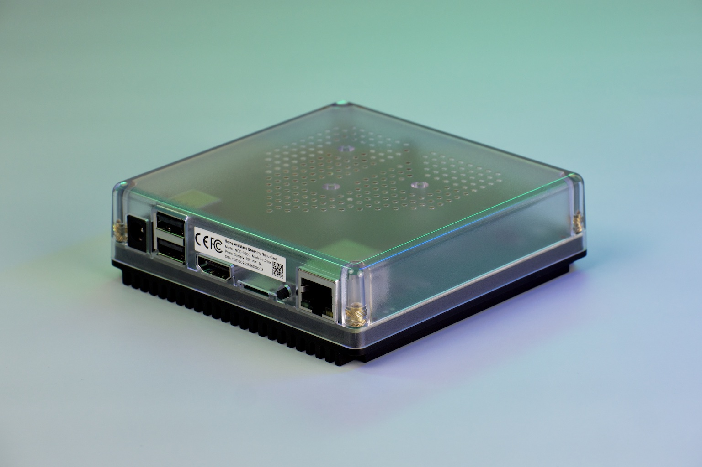
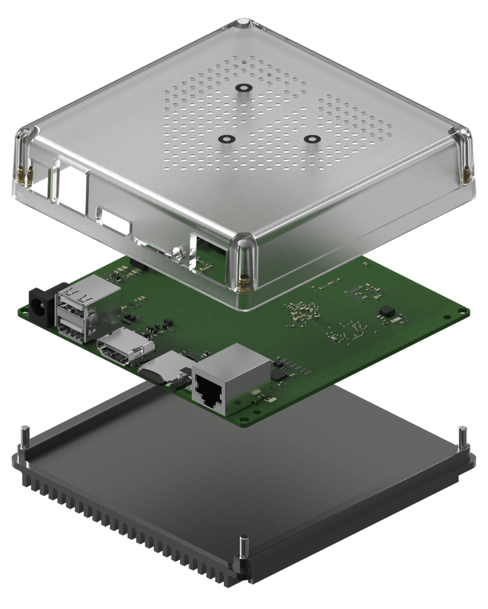
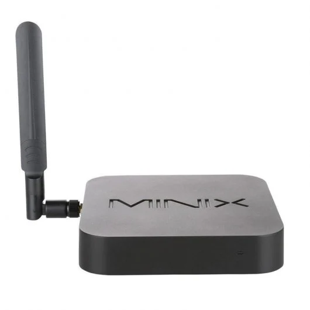

# Hardware necesario

## Servidor

El servidor donde se ejecuta Home Assistant es la pieza base de todo el sistema. En él se ejecutará el propio sistema, bases de datos, servidores, pasarelas, node-red, ... y 

### [Home Assistan Green](https://www.home-assistant.io/green/)

Se trata de un equipo vendido por Home Assistant, con unas características estupendas  que ya tiene instalado y con más de 1000 integraciones ya instaladas

* Procesador ARM quad-core a 1.8 GHz
* 4 Gb RAM
* 32 Gb de almacenamiento eMMC
* Puerto Giga ethernet

Incluye la placa, caja, alimentación y cable ethernet gigabit a un precio de 99$

### Raspberry Pi

Se recomienda al menos la Raspberry Pi 4 con un mínimo 4 Gb de RAM

Si tenéis una Raspbery 3+ será suficiente, pero al tener 1Gb de RAM nos limita algunas de las formas de instalación

Puntos débiles: las tarjetas SD tiene una vida corta

## Hardware típico

* Rasbperry Pi 4: puede funcionar en la 3+ pero va ajustado
* Alimentación adecuada, cuidado con usar una muy ajustada
* Tarjeta SD: recomendamos 32Gb

### Raspberry compatibles

ODroid, es la opción que recomiendan desde Home Assistant por su excelente relación calidad/precio. De hecho es la base de su producto [Home Assistant Blue](https://www.home-assistant.io/blue/)

La mayor diferencia es que admite discos de estado sólido eMMC lo que mejora el rendimiento y alarga la duración del sistema.

ODroid N2+

### Banana Pi

[banana Pi](https://www.amazon.es/youyeetoo-Banana-BPI-M5-Amlogic-S905X3/dp/B0B4NHBN32/ref=sr_1_5)

### MiniPCs

[minix](https://www.pccomponentes.com/minix-z83-4-max-intel-x5-z8350-4gb-128gb-emmc)

[Beelink](https://www.amazon.es/dp/B08L84LKVQ?ref_=cm_sw_r_apan_dp_1ZS0881EEAK1X94WCEV0)

[miniPC Asus]...

## Equipos Synology NAS 

Los equipos NAS de Synology nos permiten además de usarse como almecenamiento en red incluir determinados  sistemas como Home Assistant.

No todos los modelos soportan la instalación de Home Assitant mediante Docker

[Equipos NAS compatibles](https://www.pacienciadigital.com/mejor-hardware-home-assistant/#SYNOLOGY_NAS)

## Conectores

Según el tipo de dispositivo necesitamos conectores o pasarelas entre los distintos sistemas

* RF 433MHz
* Zigbee
* ¿Tuya? 

## Sensores

## Actuadores

## Dispositivos

