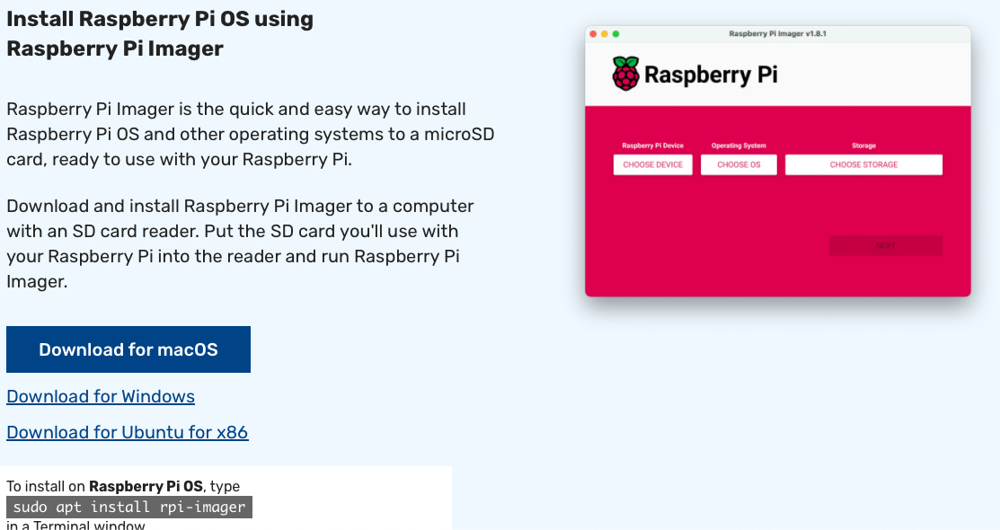
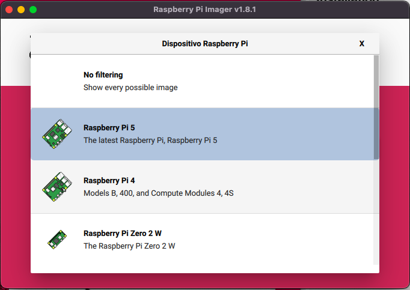
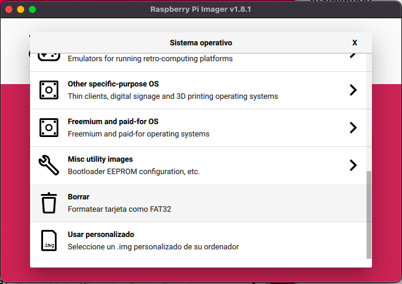
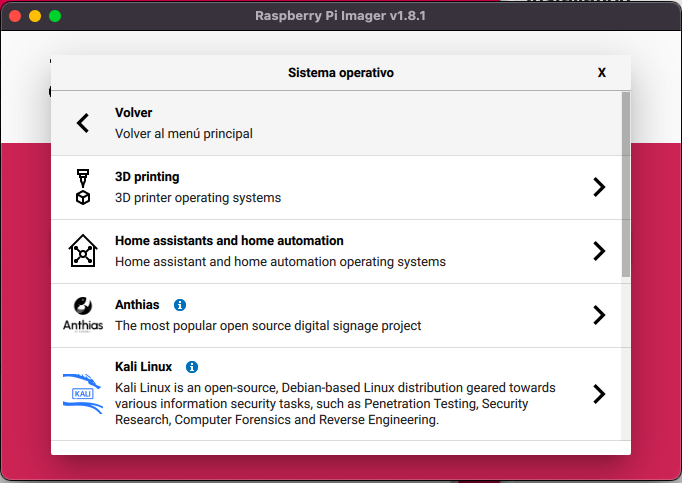
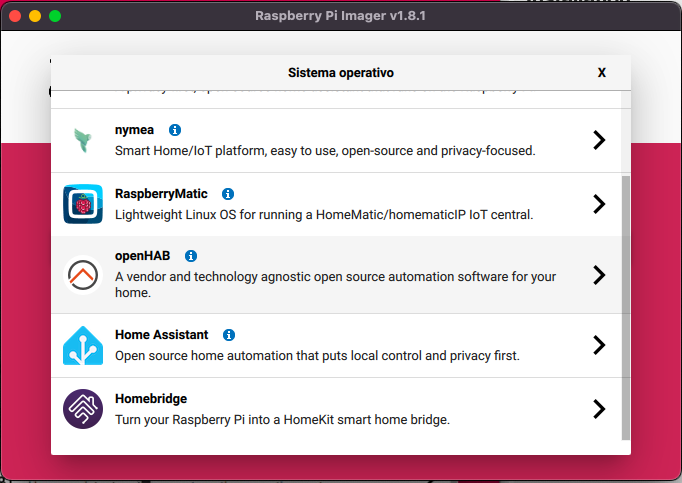
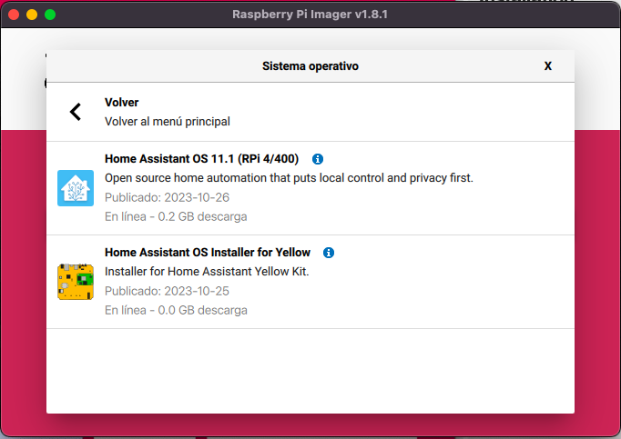
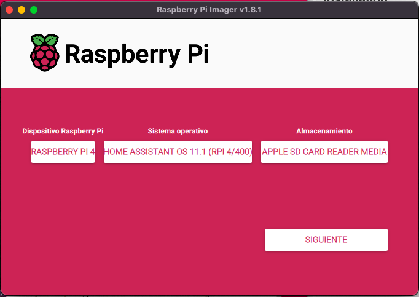
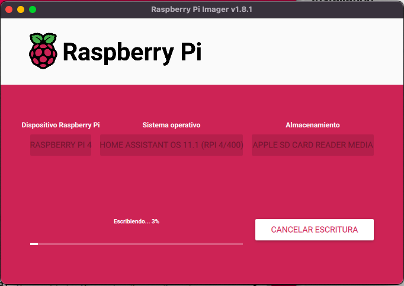

## Instalacion

[Descargamos Raspberry Pi Imager](https://www.raspberrypi.com/software/)

La arrancamos conectada el router de casa y accedemos desde nuestro PC a [http://homeassistant.local:8123](http://homeassistant.local:8123)

ha> network update wlan0 --ipv4-method auto --ipv6-method auto --wifi-auth wpa-psk --wifi-mode infrastructure --wifi-ssid MAGICBUS --wifi-psk OOMPAH

(https://community.home-assistant.io/t/configure-wifi-connection/157201/26)

Parar

ha> core stop
ha> host shutdown

(https://community.home-assistant.io/t/how-to-turn-off-home-assistant-correctly/381008/3)

## Documentación

[Tutorial de instalación de Home Assistant](https://www.home-assistant.io/installation/raspberrypi)

[Tutorial de Paciencia digital][https://www.pacienciadigital.com/instalacion-home-assistant-paso-a-paso/]

