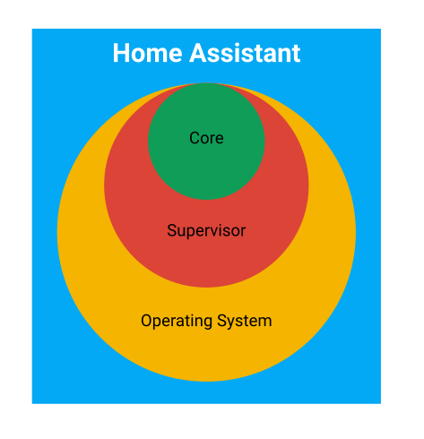

Architecture Overview

Home Assistant es una plataforma para el control y automatización del hogar, no es una aplicación. También incluye el interface para interconectar los diferentes dispositivos.

* El sistema operativos es un sistema Linux mínimo donde se ejecutan Supervisor y Core
* El Supervisor gestiona el sistema operativo
* El Core interacciona con el usuario, con el supervisor y con los dispositivos IOT y servicios

