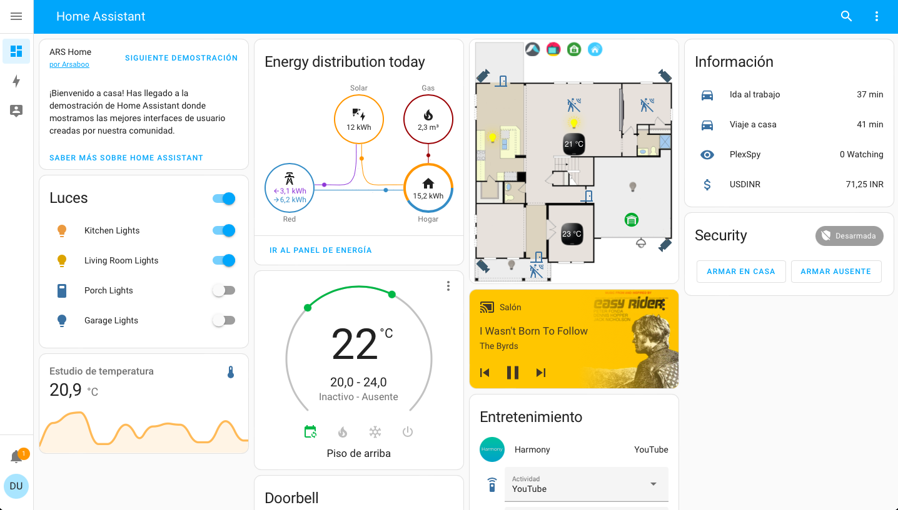

## Integraciones

Son como los "drivers" que permite a HA conectar con los dispositivos

[Listado de integraciones](https://www.home-assistant.io/integrations)

## Dispositivos y entidades

Un dispositivo puede tener varios sensores ejemplo de dispositivo con varias entidades

## Automatizaciones

Podemos definir condiciones que dispararán acciones

Tiene 3 componentes:

* Disparador (trigger)
* Condición
* Acción a realizar

Existen automatizaciones predefinidas: los blueprints 

También podemos [crear las nuestras propias](https://www.home-assistant.io/docs/automation/basics/)

## Script

Es una lista de acciones a ejecutar

## Escenas

Es un conjunto de configuraciones de los dispositivos

Por ejemplo: modo noche o fin de semana

## Blueprints

Son scritps en formato esquema para definir las automatizaciones

https://www.home-assistant.io/docs/blueprint/

## Dashboards 

HA proporciona acceso a los datos de los dispositivos y servicios que podemos mostrar al usuario en los "Dashboards" 

pantallas predefinidas para mostar información

hay un editor

son personalizables

[Demo](https://demo.home-assistant.io/#/lovelace/0)

## Add-ons

Complementos que amplían la funcionalidad como por ejemplo el SSH & web terminal nos da acceso remoto
