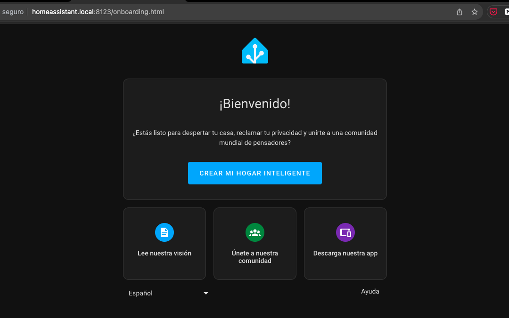

# Onboarding

Accedemos a http://homeassistant.local:8123

0. Desde aquí podríamos restaurar una versión anterior a partir de una copia de seguridad

1. Si es una nueva instalación "Create my smart home"
2. Creamos la cuenta con el nombre y contraseña de usuario

3. Seleccionamos la ubicación
4. Si queremos podemos enviar datos para compartir con HA

5. Se buscan dispositivos compatibles a traves de las redes

6. Terminamos la instalación, nos queda añadir los dispositivos no detectados y configurar el aspecto y el comportamiento de HA

[Tutorial](https://www.home-assistant.io/getting-started/onboarding)

## Pendiente

¿cambiar nombre de la máquina?