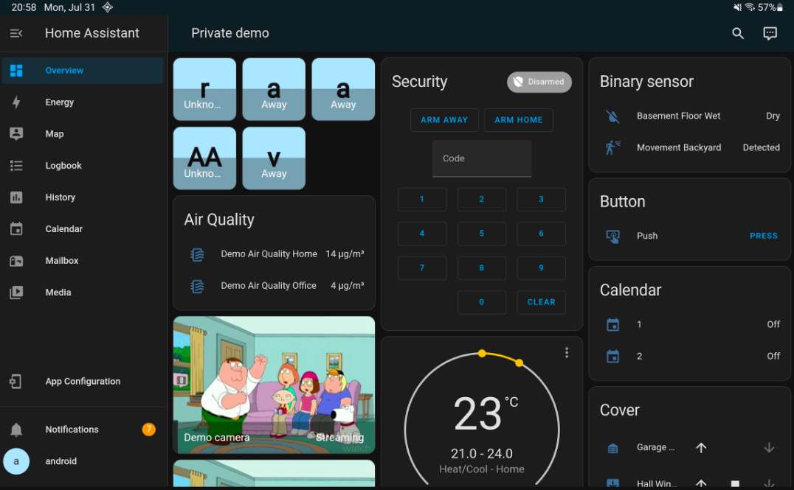

## ha 

network
    info
host 
    info
    shutdown 

core
    info

os
    info

supervisor
    info

## web 
http://hostassistant.local:8123

## Apps

[Home Assistant para Android](https://play.google.com/store/apps/details?id=io.homeassistant.companion.android&hl=es_PE)

[Home Assistant para Apple](https://apps.apple.com/us/app/home-assistant/id1099568401?ls=1) Disponible para iOS y MacOS 

## SSH instalar extensión

https://community.home-assistant.io/t/home-assistant-community-add-on-ssh-web-terminal/33820

## Local

Ctrl+Alt+F2 abre una consola: usuario "root" sin password por defecto.

Se cambia desde la configuración

## Remoto

https://www.home-assistant.io/docs/configuration/remote/

Home Assistant Cloud

VPN

Port Forwarding