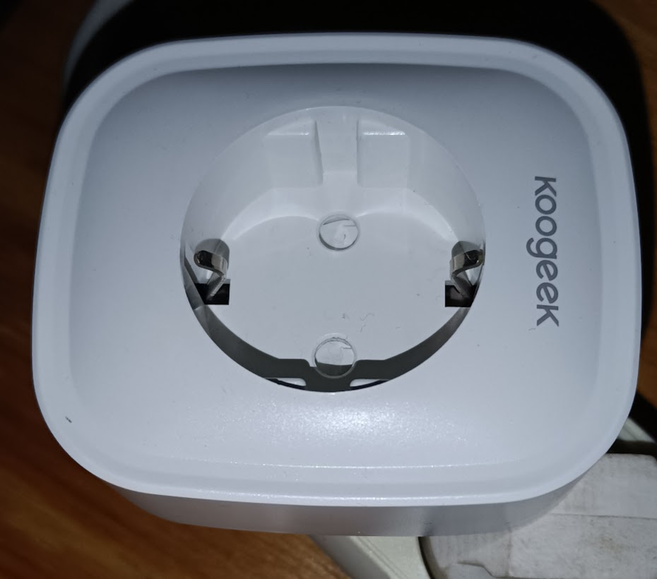

## Marcas

Xiaomi
Huawei
Philips
Fibaro
Aqara
Ikea
Shelly
Itead (sonnoff)

## Sensores

atmosféricos: temperatura, presión, viento, humedad del aire
presencia
iluminación
humedad del suelo
Luz ambiental

## Actuadores

Relés
Motores
Tiras de leds

## Comunicaciones

ethernet
Wifi: shelly
Bluetooth
RF 433MHz
zWave
zigbee: aqara & ikea

Para algunos protocolos necesitaremos adaptares/pasarelas

### Comunicaciones a través de internet o locales

Algunos dependen del fabricante y necesitan acceso a internet para comunicarse con los servidores del fabricante

Por ejemplo los sonnoff (Itead) nesitan la aplicación ewelink

En caso de falta de conexión no los tenemos operativos. Además está el tema de la privacidad de nuestros datos

HA puede establecer una conexión con estos servidores para automatizar 

A algunos de ellos se les puede actualizar el firmware para que se comuniquen local

## Enchufes inteligentes

### Koogeek

App: [Smart Life](https://play.google.com/store/apps/details?id=com.tuya.smartlife&hl=es&gl=US)

### Sonoff

App: [eWeLink](https://play.google.com/store/apps/details?id=com.coolkit&hl=es&gl=US)

### Otros

[Enchufe inteligente Eightree](https://www.amazon.es/dp/B0B74NQB6C)

[Regleta Eightree](https://www.amazon.es/Eightree-Inteligente-enchufes-medición-Compatible/dp/B0C6X3YWTZ/ref=sr_1_11?keywords=Eightree&qid=1696528842&sr=8-11)

[TP-link Tapo P100 con monitoreo de consumo](https://www.amazon.es/dp/B083FF167K?tag=pacienciaamaz-21&linkCode=ogi&th=1&psc=1)

[Cámara TP-link](https://www.amazon.es/dp/B07XLML2YS?tag=pacienciaamaz-21&linkCode=ogi&th=1&psc=1)

[Sensores de puertas y ventanas](https://www.amazon.es/dp/B07D37VDM3?tag=pacienciaamaz-21&linkCode=ogi&th=1&psc=1)

[Sensores de presencia](https://www.amazon.es/dp/B09MYSWVP1?tag=pacienciaamaz-21&linkCode=ogi&th=1&psc=1)

[Sensor de temperatura](https://www.amazon.es/dp/B0BR5D9QLG?tag=pacienciaamaz-21&linkCode=ogi&th=1&psc=1) [conexión con Home Assistant](https://github.com/KalininAndreyVictorovich/mitemp_cgg1-home-assistant)

[Tiras led inteligentes](https://www.pacienciadigital.com/wled-esp32-home-assistant/)
