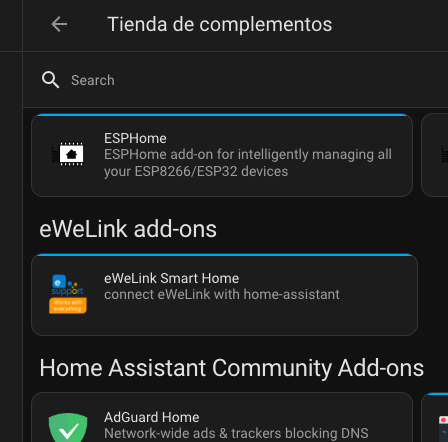
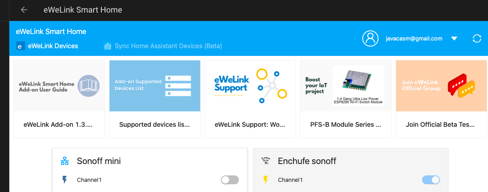

# Integraciones
 una integración es la instalación de un software que complementa a Home Assistant aunque no es propiamente de Home Assistant. Es un software de terceros que instalamos y con el que HA puede interaccionar

 Algunos software están aprobados directamente por HA y aparecen en su tienda de complementos, por ejemplo el complemento de Tuya/Smart Life

Otros están permitidos y podemos añadirlo a través de repositorio incluimos el repositorio de los complementos y ya podremos añadir el complemento desde la tienda. Por ejemplo el complemento eWelink para los dispositivos Sonoff

También existen algunos denominados HACS que ni siquiera están autorizados y que tenemos que trapichear un poquito con asistan para permitirlo son los HACS, por ejemplo los de Tp-link-Tapo

## Integraciones aprobadas por HA

## Smart Home o Tuya

* Damos de alta los dispositivos en la aplicación Smart Home o Tuya
* Creamos cuenta en [Tuya IOT](https://iot.tuya.com/cloud/?id=p1699222959241ncyp7x)
* Creamos proyecto
* Añadimos Key para App (escaneando QR con la app)

Cuidado con el datacenter elegido

[Guía para elegir datacenter](https://github.com/tuya/tuya-home-assistant/blob/main/docs/regions_dataCenters.md)

Desde HA añadimos Tuya 

En todo momento podemos recargar los nuevos dispositivos

[Tutorial](https://www.home-assistant.io/integrations/tuya)

## Integraciones externas autorizadas por HA

## Sonoff

Añadimos el repositorio y ya podemos incluir el complemento

