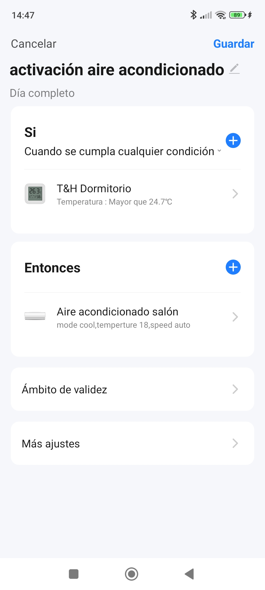

# Tuya o Smart Life

## Smart Home o Tuya

* Damos de alta los dispositivos en la aplicación Smart Home o Tuya
* Creamos cuenta en [Tuya IOT](https://iot.tuya.com/cloud/?id=p1699222959241ncyp7x)
* Creamos proyecto
* Añadimos Key para App (escaneando QR con la app)

Cuidado con el datacenter elegido

[Guía para elegir datacenter](https://github.com/tuya/tuya-home-assistant/blob/main/docs/regions_dataCenters.md)

Desde HA añadimos Tuya 

En todo momento podemos recargar los nuevos dispositivos

[Tutorial](https://www.home-assistant.io/integrations/tuya)

## Escenas de App Tuya

https://community.home-assistant.io/t/tuya-smart-ir-with-home-assistant/400211/3

