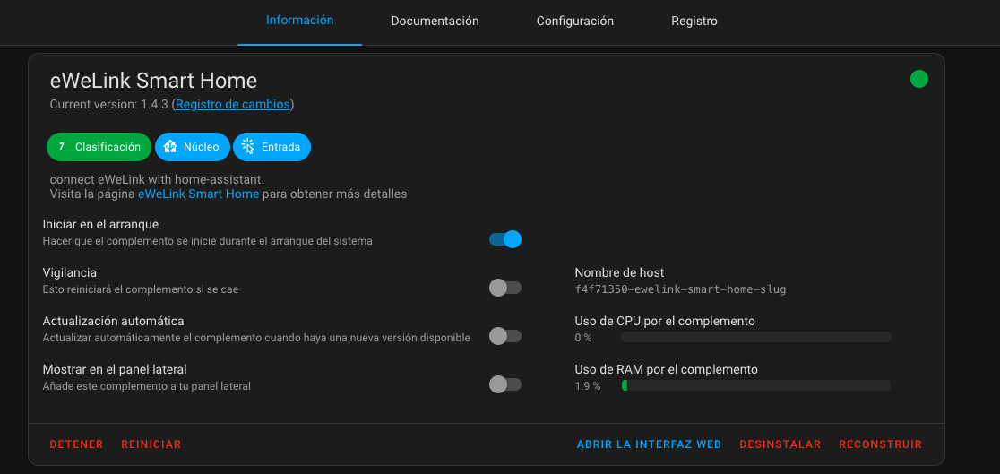
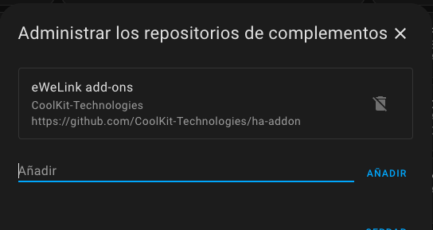
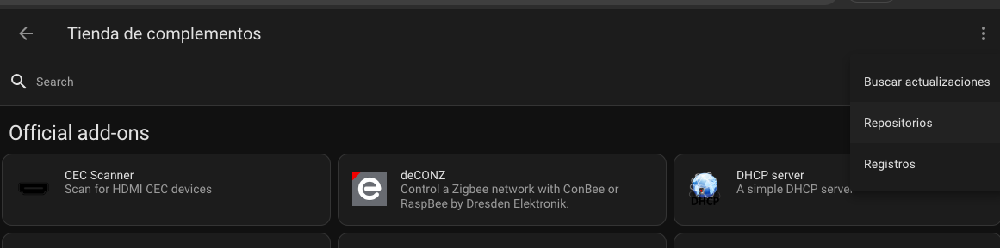
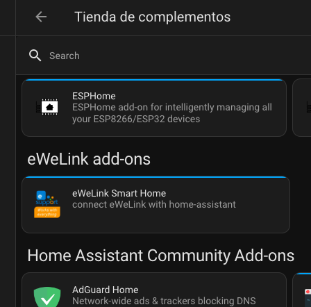
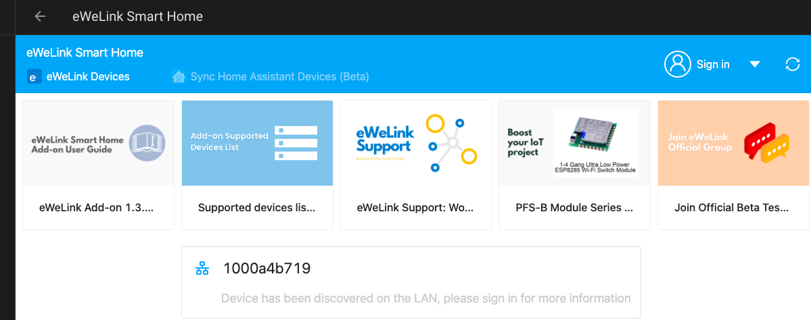
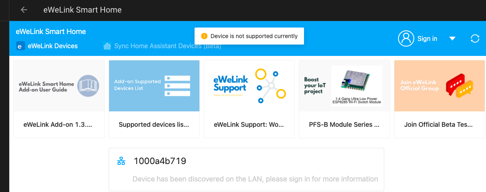
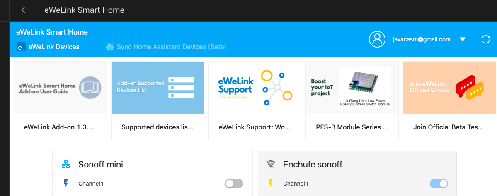

## Integración Sonoff

Añadimos el repositorio y ya podemos incluir el complemento

## Domotica con sonof

## Sonoff RF 433MHz

### Pulsadores

[Producto](https://www.banggood.com/Wireless-Remote-Transmitter-Sticky-RF-TX-Smart-For-Home-Living-Room-Bedroom-433MHZ-86-Wall-Panel-Works-With-SONOFF-RFRFR3SlampheriFan034CHProR2TX-Series433-RF-Bridge-p-1540771.html)

### Bridge RF

[Producto](https://www.banggood.com/SONOFF-RF-Bridge-WiFi-433-MHz-Replacement-Smart-Home-Automation-Universal-Switch-p-1179900.html)

[Detalles y modificaciones](https://github.com/arendst/Tasmota/wiki/Sonoff-RF-Bridge-433)

[How to Flash](https://github.com/arendst/Tasmota/wiki/How-to-Flash-the-RF-Bridge)

[Funcionamiento del bridge](https://hometechhacker.com/using-a-sonoff-rf-bridge-to-expand-your-smarthome/)

### Add RF to sonoff

[Add RF to sonoff](https://tinkerman.cat/post/adding-rf-to-a-non-rf-itead-sonoff/)

