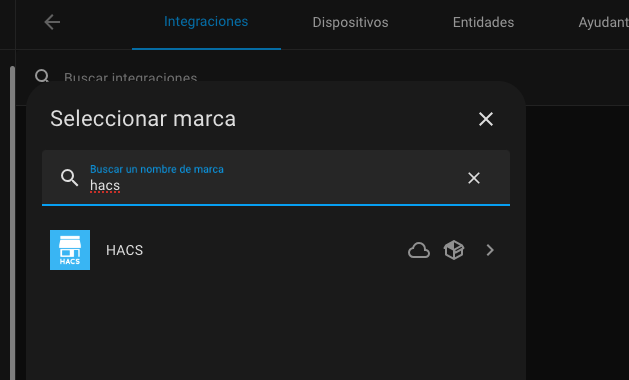
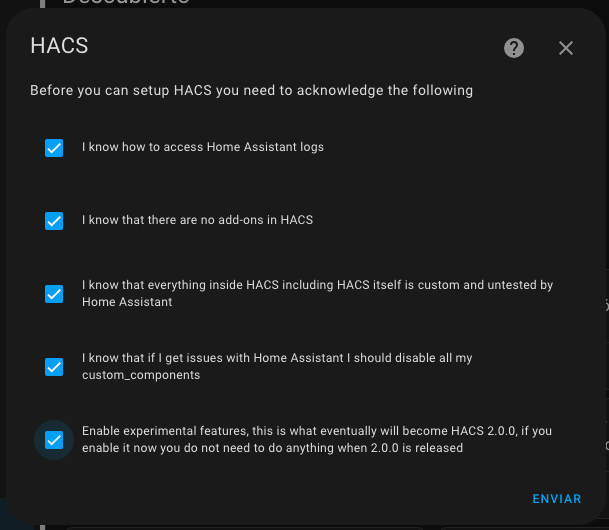
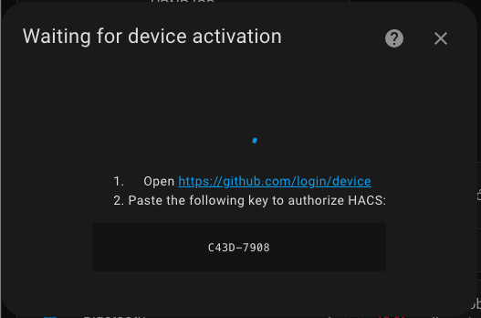
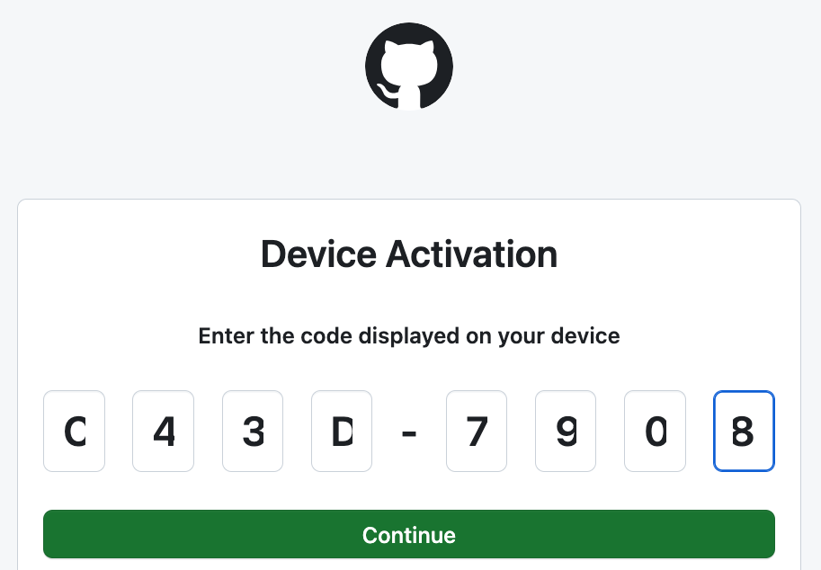
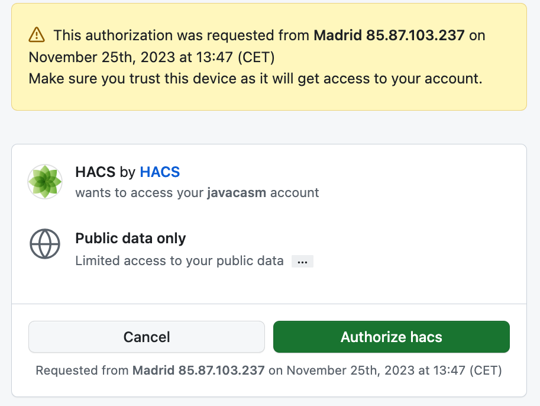

# HACS

¿Qué es HACS?: un gestor de complementos no autorizados para HA, normalmente porque acceden a dispositivos de una forma no soportada/autorizada por los fabricantes

Lo usamos para añadir integraciones de fabricantes como TP-Link/Tapo

Incluye:

* Custom Integracions
* Custom UI elements 
* Entorno de ejecución de tareas ([AppDaemon](https://appdaemon.readthedocs.io/en/latest/))
* Temas
* scripts en python

## Configuración

[Configuración](https://hacs.xyz/docs/configuration/basic)

Desde el addon SSH ejecutamos 

```sh
wget -O - https://get.hacs.xyz | bash -
```

Cuando termine reiniciamos

que se encargará de preparar nuestro HA para HACS

Añadimos la integración de HACS



ACeptamos la condiciones....



Autorizamos a HACS para acceder a github usando la autorización OAuth








