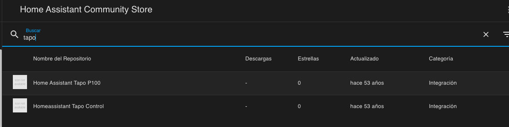
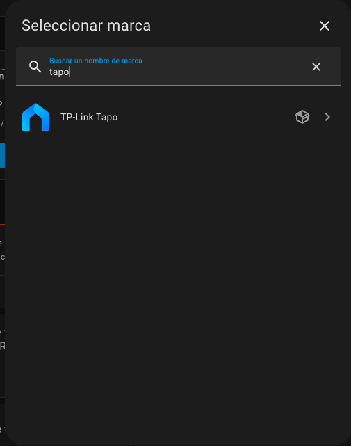
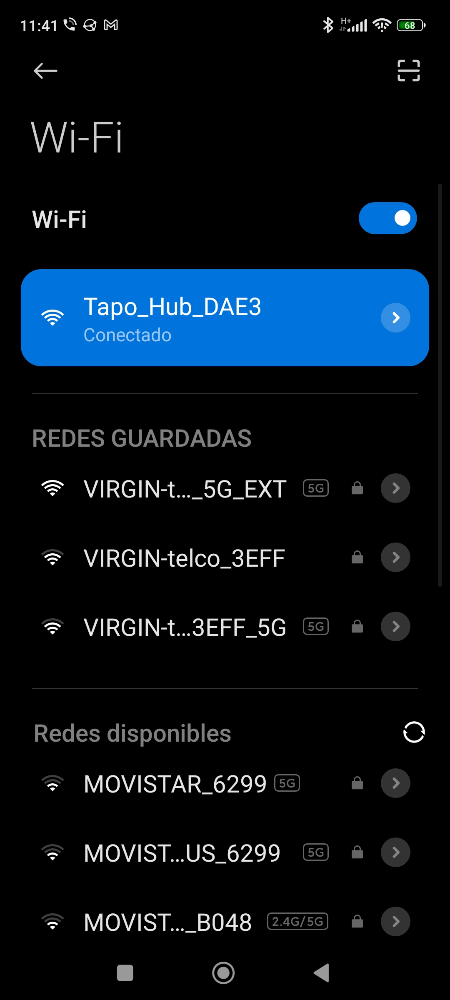
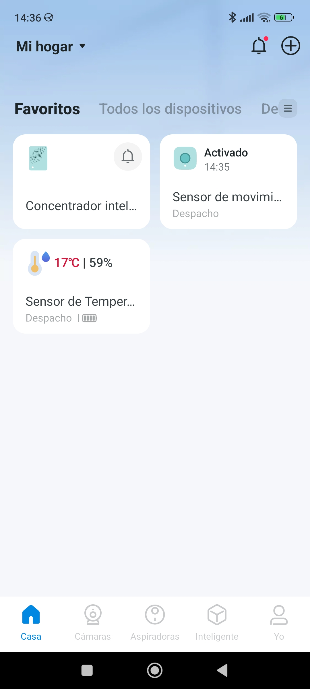
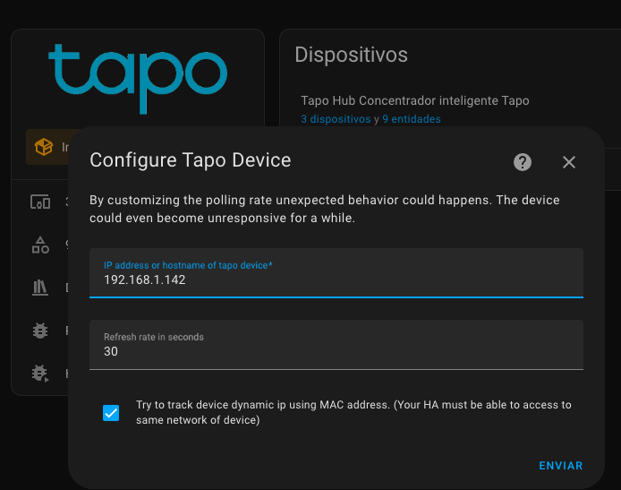
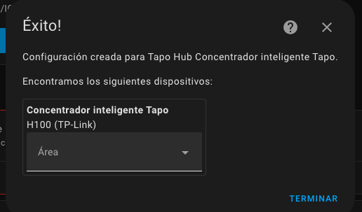
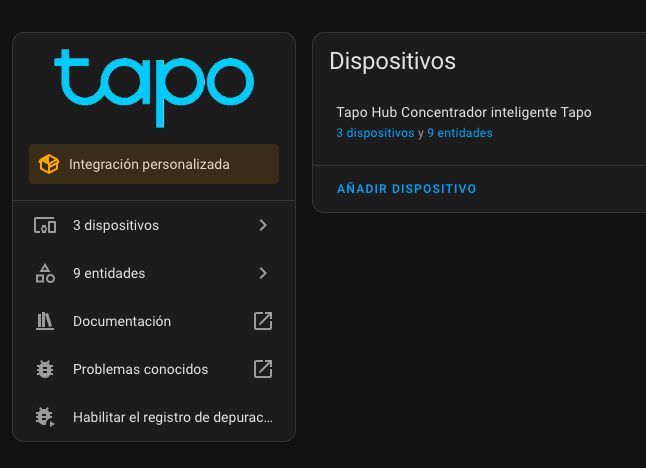
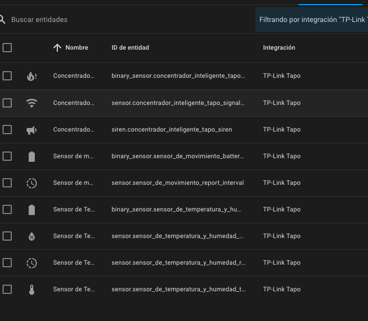

## TPlink Tapo

Desde HACS Store instalamos Tapo Controller

Una vez autorizado abrimos el complemento HACS y ya podemos buscar las integraciones custom

Una vez seleccionado y abierto descargamos la integración

Ahora reiniciamos HA

Ya podemos buscar la integración normalmente

## Tapo app

Desde la aplicación Tapo damos de alta los dispositivos, para lo que tendremos que dar de alta el concentrador conectándonos a su wifi

Cuando los tengamos detectados

Damos de alta el dispositivo para lo que necesitamos user/pass de Tapo y la ip del concentrador

Conectamos con el concentrador 

Los veremos en la integración con HA

sus entidades

## Cámaras

https://www.youtube.com/watch?v=T9hM8Q62TUQ

https://github.com/JurajNyiri/HomeAssistant-Tapo-Control