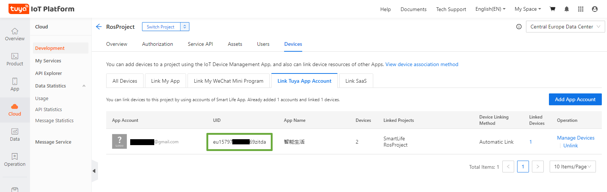

## Local Tuya

Local Tuya, nos permite controlar algunos de los dispositivos soportados por Tuya de manera local, accediendo a su IP y al mismo tiempo controlarlos desde los servidores de Tuya (lo que permite seguir usando su App)

1. Instalamos desde HACS
1. Añadimos dispositivo indicando los datos de conexion a IOT Tuya 
1. Necesitamos extrar nuestro ID de usuario que sacaremos del permiso que dimos a nuestra App al crear el proyecto IOT Tuya

¿Local KEY?

Para dispositivos con medida de potencia https://community.home-assistant.io/t/local-tuya-guide-for-complex-devices/474805/2

https://www.zonagadget.com/local-tuya-controlando-dispositivos-tuya-smartlife-en-home-assistant-sin-usar-la-nube/
