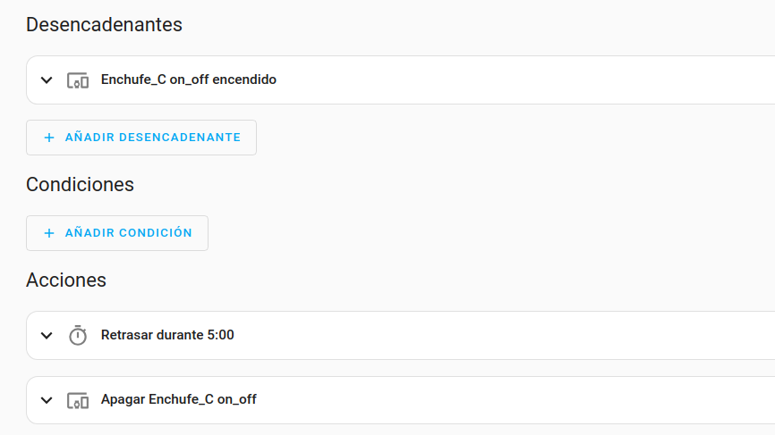

# automatizaciones

1. Configuras el disparador (trigger)
2. Eliges la acción que se reallizará

## Pronostico del tiempo

https://community.home-assistant.io/t/simple-automation-based-on-the-current-weather/307727