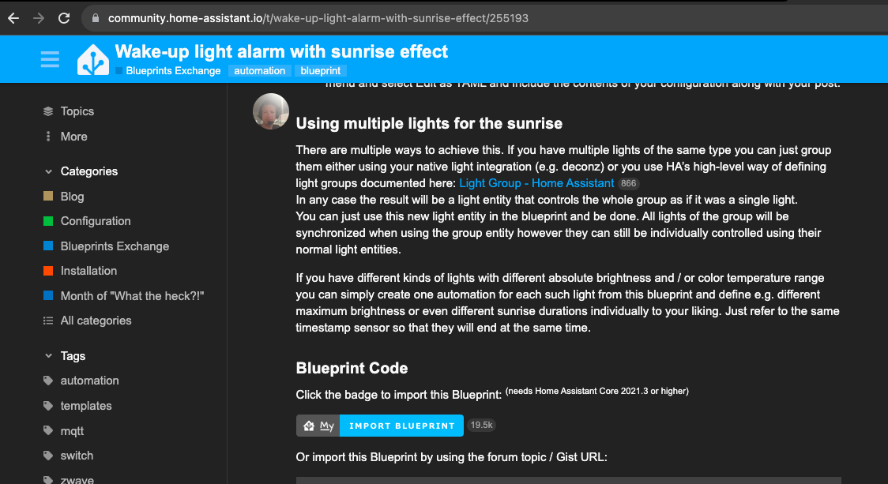
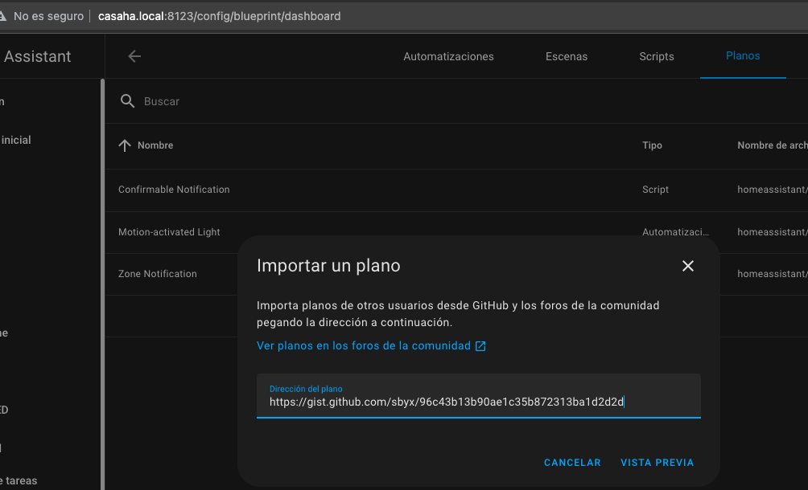

# Blueprints

Los planos o Blueprints son script o automatizaciones que hacen y comparten los usuarios y que podemos incorporar de forma muy sencilla a nuestro HA, importándolos

Para importarlos necesitamos configurar "My Home Assistant"

[Detalles](https://www.home-assistant.io/docs/automation/using_blueprints/)