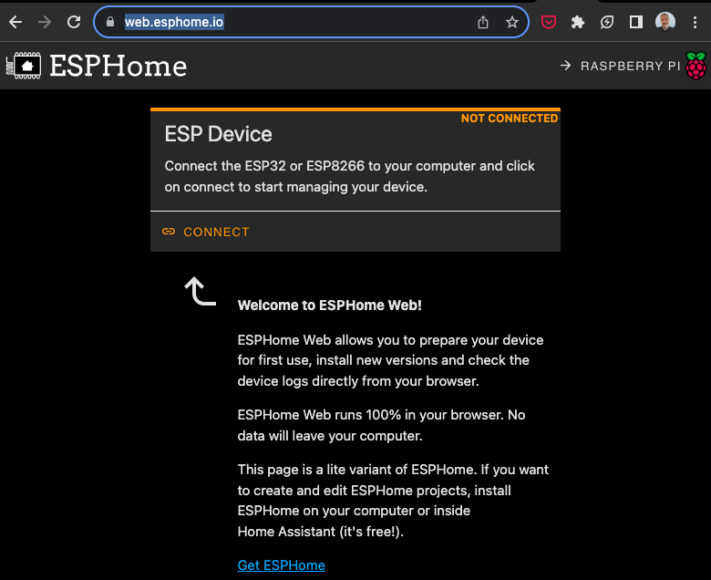
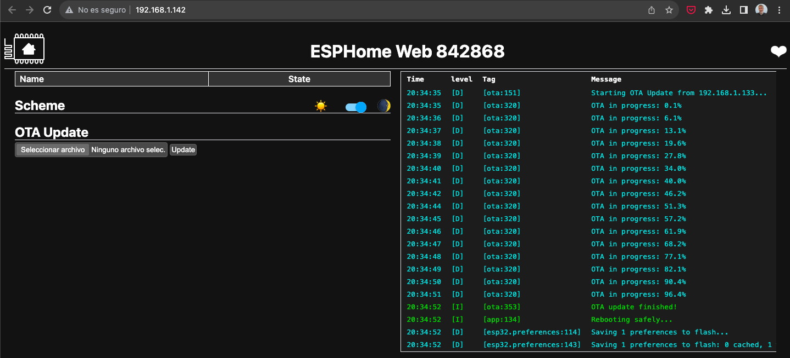
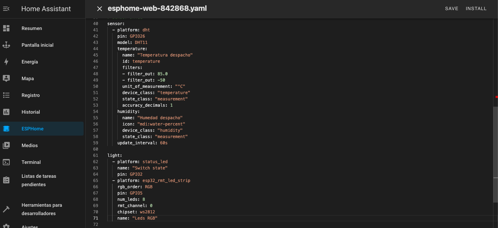
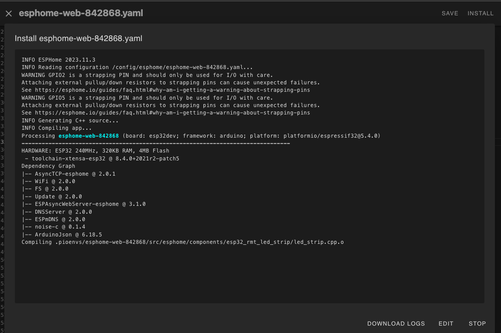
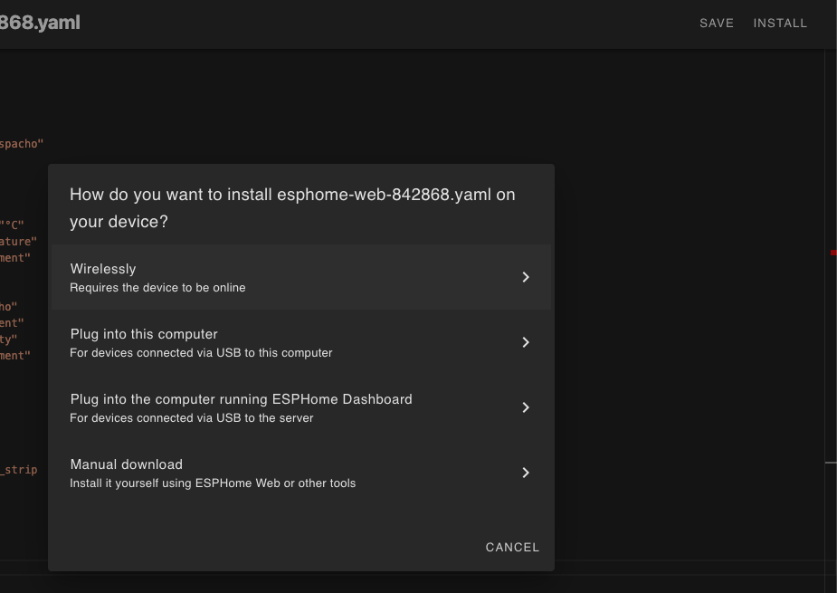
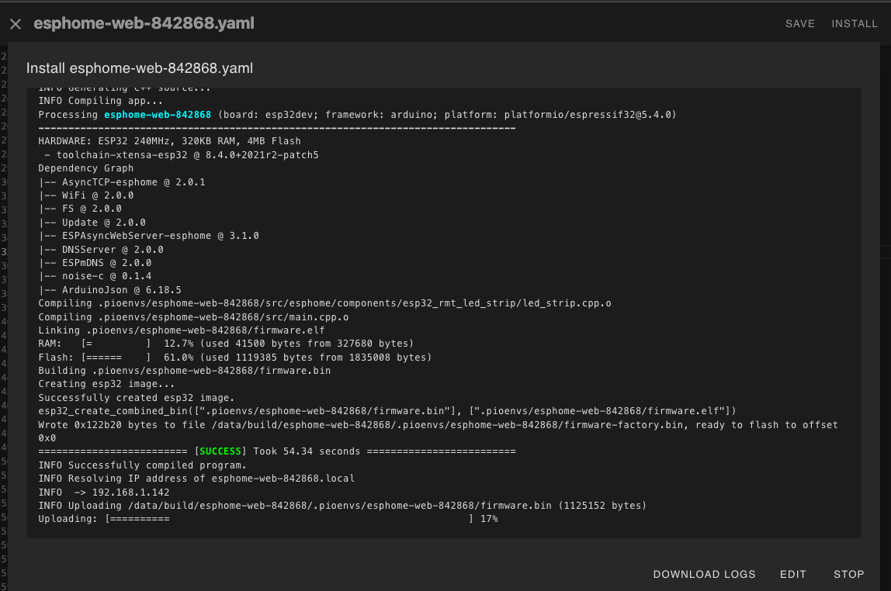

# Instalación

Nos permite actualizar la programación desde local con USB o por wifi vía

Desde [https://web.esphome.io/](https://web.esphome.io/) hacemos una primera instalación 

Debemos tener conectado el dispositivo por USB

Seleccionamos el firmware que habremos generado desde la página ESPHome de HA

y lo subimos a la placa

Si no lo hemos hecho ya, configuramos el wifi y ya tenemos acceso desde HA que lo detectará

Podemos ver el registro de lo que va haciendo nuestro ESP desde la web de esphome.io

Si hay problemas wifi lo veremos si la placa sigue conectada al USB y podemos ver las redes que se detectan

Si tenemos conexión wifi con el dispositivo también podemos acceder directamente a la IP del dispositivo

Y ya tenemos disponible el acceso innalámbrio via OTA

Modificamos la configuración (fichero yaml) 

Tras compilarlo podemos subir la actualización

Tambien podemos subir una primera versión desde HA, pero tenemos que tener conecta en local el dispositivo a nuestro HA

Y subirlo

Cuando ya está conectado desde HA tendremos accesos a las entidades que estemos publicando

Pudiendo controlar los dispositivos

### Actualización

Una vez instalada una configuración, desde el complemento ESPHome podemos añadir componentes y probarlos de manera sencilla y rápida vía OTA
