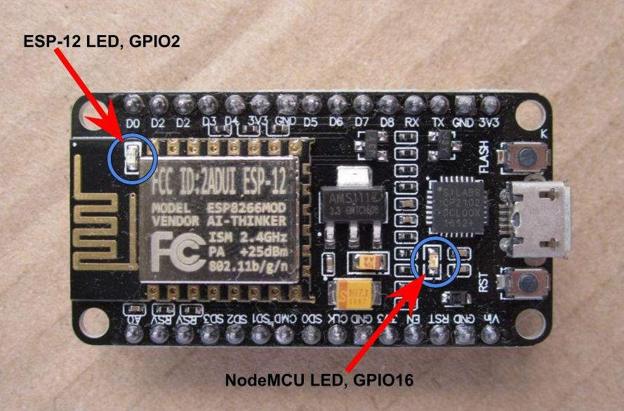
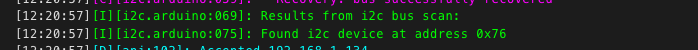

## Ejemplos

### Wifi

Vemos que hemos configurado los datos vía "Secret" para poder compartir la configuración y que en caso de que haya error de acceso al wifi genera su propia Wifi para que nos conectemos

```yaml
wifi:
  ssid: !secret wifi_ssid
  password: !secret wifi_password

  # Enable fallback hotspot (captive portal) in case wifi connection fails
  ap:
    ssid: "Esphome-Web-842868"
    password: "esQ682ybB185"
```


### LED

Para activar una luz o un led usamos la plataforma "binary", on/Off

```yaml
light:
  - platform: binary
    name: "Board led"
    output: light_output
output:
  - id: light_output
    platform: gpio
    pin: 
      number: GPIO16
      inverted: true
```

Definimos una "output" (salida) para luz, con su pin asociado, también podemos indicar si la salida es invertida (como en este caso) y al activarla se apaga. Existen salidas más complejas como las DAC o las RGB con varios canales.

[Detalles binary](https://esphome.io/components/light/binary.html)

[Detalles output](https://esphome.io/components/output/#output)

También podemos usarlos como indicador de status al indicar la plataforma "status_led". El sistema lo utiliza para indicar actualización, avisos o errores.

```yaml
light:
  - platform: status_led
    name: "Switch state"
    pin: GPIO2
```

[Detalles status-led](https://esphome.io/components/status_led.html)

### NodeMCU

También podemos usar un ESP8266 de tipo NodeMCU que tiene 2 leds, uno en el módulo ESP y otro en la placa.  Usamos el del módulo



```yaml
light:
  - platform: status_led
    name: "Status Led"
    pin: 
      number: GPIO2
      inverted: true
  - platform: binary
    name: "Board led"
    output: light_output
```

### Ejemplo MQTT

Al configurar la sección MQTT se publiclarán todos los datos y las acciones

```yaml
mqtt:
  topic_prefix: /casa
  broker: !secret mqtt_broker
  port: 1883
  username: !secret username_mqtt
  password: !secret password_mqtt
  discovery_prefix: homeassistant
```


### Sensor DHT11

```yaml
# https://esphome.io/components/sensor/index.html
# Sensor DHT11
sensor:
  - platform: dht
    pin: GPIO26
    model: DHT11
    temperature:
      name: "Temperatura despacho"
      id: temperature
      filters:   
      - filter_out: 85.0
      - filter_out: -50
      unit_of_measurement: "°C"
      device_class: "temperature"
      state_class: "measurement"
      accuracy_decimals: 0
    humidity:
      name: "Humedad despacho"
      icon: "mdi:water-percent"
      device_class: "humidity"
      state_class: "measurement"
    update_interval: 60s
```

### LED RGB

```yaml
light:
  - platform: esp32_rmt_led_strip
    rgb_order: GRB
    pin: GPIO13
    num_leds: 30
    rmt_channel: 0
    chipset: ws2812
    name: "My Light"
```

[Detalles](https://esphome.io/components/light/esp32_rmt_led_strip)


### Servo

[Detalles](https://esphome.io/components/servo.html?highlight=servo)

[Tutorial](https://siytek.com/esphome-servo-example/)


### I2C

```yaml
i2c:
  sda: 21
  scl: 22
  scan: true
  id: bus_a

```
El scan se hace al principio y nos permite saber si se han detectado bien los dispositivos



[Detalles I2C](https://esphome.io/components/i2c#i2c)

Ejemplo de sensor i2c

```yaml
- platform: bme680
  i2c_id: bus_b
  address: 0x76
```


### Sensores BME/BMP

Requieren que I2C esté configurado

#### BMP280 Temperatura y presión

```yaml
sensor:
  - platform: bmp280
    temperature:
      name: "Outside Temperature"
      oversampling: 16x
    pressure:
      name: "Outside Pressure"
    address: 0x77
    update_interval: 60s
```

[Detalles](https://esphome.io/components/i2c#i2c)


### BME280 Temperatura, Humedad y presión

```yaml
# Example configuration entry
sensor:
  - platform: bme280
    temperature:
      name: "BME280 Temperature"
      oversampling: 16x
    pressure:
      name: "BME280 Pressure"
    humidity:
      name: "BME280 Humidity"
    address: 0x77
    update_interval: 60s
```

### Pantalla LCD

(i2c tiene que estar configurado)

```yaml
display:
  - platform: lcd_pcf8574
    dimensions: 16x2
    address: 0x27   
    lambda: |-
      it.print(0,1,"Hello World!");

      // Let's write a sensor value (let's assume it's 42.1)
      it.printf("%.1f", id(my_sensor).state);
      // Result: "42.1" (the dot will appear on the segment showing "2")

      // Print a right-padded sensor value with 0 digits after the decimal
      it.printf("Sensor value: %8.0f", id(my_sensor).state);
      // Result: "Sensor value:       42"

      // Print the current time
      it.strftime("It is %H:%M on %d.%m.%Y", id(my_time).now());
      // Result for 10:06 on august 21st 2018 -> "It is 10:06 on 21.08.2018"

# (Optional) For displaying time:
time:
- platform: homeassistant
  id: my_time
```

### Matrices LED


```yaml
light:
  - platform: fastled_clockless
    chipset: WS2812B
    pin: GPIO4
    num_leds: 64
    rgb_order: GRB
    name: "led_matrix"
    id: led_matrix_light
    default_transition_length: 0s
    color_correct: [50%, 50%, 50%]
    restore_mode: ALWAYS_ON

display:
  - platform: addressable_light
    id: led_matrix_display
    addressable_light_id: led_matrix_light
    width: 8
    height: 8
    rotation: 180°
    update_interval: 16ms
    lambda: |-
          // Draw a bulls-eye pattern
          Color red = Color(0xFF0000);
          Color green = Color(0x00FF00);
          Color blue = Color(0x0000FF);
          it.rectangle(0, 0, 8, 8, red);
          it.rectangle(1, 1, 6, 6, green);
          it.rectangle(2, 2, 4, 4, blue);
          it.rectangle(3, 3, 2, 2, red);
```

[Detalles matrices leds](https://esphome.io/components/display/addressable_light.html?highlight=led)


[Detalles](https://esphome.io/components/display/lcd_display.html)
