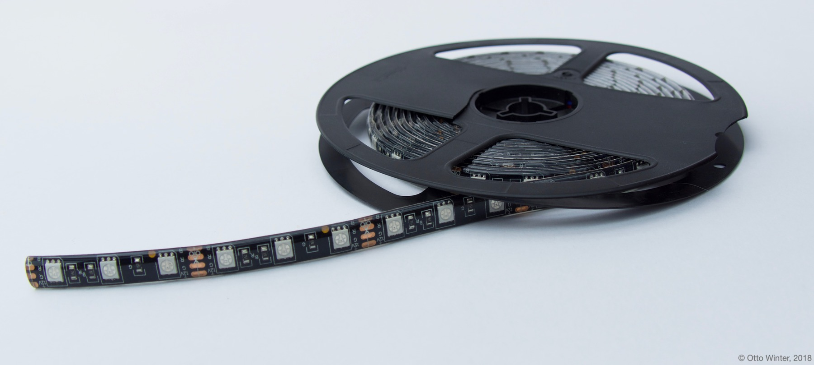

## Ejemplos

### Wifi

Vemos que hemos configurado los datos vía "Secret" para poder compartir la configuración y que en caso de que haya error de acceso al wifi genera su propia Wifi para que nos conectemos

```yaml
wifi:
  ssid: !secret wifi_ssid
  password: !secret wifi_password

  # Enable fallback hotspot (captive portal) in case wifi connection fails
  ap:
    ssid: "Esphome-Web-842868"
    password: "esQ682ybB185"
```


### Luces o LEDs

Para activar una luz o un led podemos usar diferentes plataformas, según sea el tipo de control que queremos hacer, usando encendido todo/nada o un brillo progresivo o controlando su color.

Usamos la plataforma "binary" para control básico de encendido/apagado, on/Off, todo/nada

```yaml
light:
  - platform: binary
    name: "Board led"
    output: light_output
output:
  - id: light_output
    platform: gpio
    pin: 
      number: GPIO16
      inverted: true
```

Definimos una "output" (salida) para luz, con su pin asociado, también podemos indicar si la salida es invertida (como en este caso) y al activarla se apaga. 

[Detalles binary](https://esphome.io/components/light/binary.html)

También podemos usarlos como indicador de status al indicar la plataforma "status_led". El sistema lo utiliza para indicar actualización, avisos o errores.

```yaml
light:
  - platform: status_led
    name: "Switch state"
    pin: GPIO2
```

[Detalles status-led](https://esphome.io/components/status_led.html)

Veamos cómo hacer una salida que controle el nivel de brillo, controlando la potencia usando PWM (dimmable)

```yaml
# controlamos el brillo de la led
light:
  - platform: monochromatic
    name: "Flash"
    output: flash 

output:
  - id: flash
    platform: ledc
    pin: GPIO4
```

Para ESP32 usaremos la plataforma **ledc**, si usamos un ESP8266 usaremos la plataform **esp8266_pwm**

[Detalles PWM](https://esphome.io/components/output/ledc.html)


Para un led RGB de 3 entradas (o una tira si añadimos la electrónica de potencia necesaria)



```yaml
# Example configuration entry
light:
  - platform: rgb
    name: "Living Room Lights"
    red: output_red
    green: output_green
    blue: output_blue

# Example output entry
output:
  - platform: esp8266_pwm
    id: output_red
    max_power: 80%
    pin: D1
  -platform: esp8266_pwm
    id: output_blue
    pin: D2
  -platform: esp8266_pwm
    id: output_green
    pin: D3    

```

Donde además hemos corregido la intensidad del componente rojo que suele ser más brillante que el resto


[Detalles luces RGB de 3 canales](https://esphome.io/components/light/rgb.html)

Existen salidas más complejas como las DAC o las RGB con varios canales de blanco o negro.

[Detalles output](https://esphome.io/components/output/#output)


### LED RGB Neopixel

```yaml
light:
  - platform: esp32_rmt_led_strip
    rgb_order: GRB
    pin: GPIO13
    num_leds: 30
    rmt_channel: 0
    chipset: ws2812
    name: "My Light"
```

[Detalles](https://esphome.io/components/light/esp32_rmt_led_strip)


