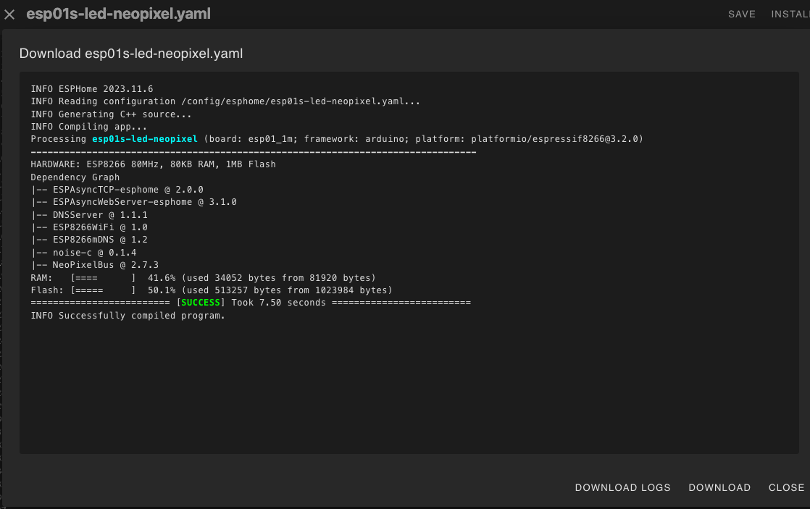
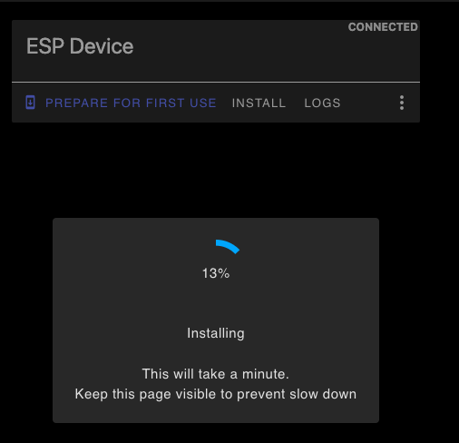

## Ejemplos ESP01s

El esp01s es la versión más reducida del esp8266 con 1Mb de almacenamiento. 

Tiene sólo 8 pines de los que podemos usar 4 como GPIO: 0, 1, 2, 3 siendo 1 y 3 Tx y Rx del UART (puerto serie). El pin 2 está conectado al led de la placa.

1. Creamos un nuevo dispositivo en el complemento ESPHome de HomeAssistant

1. Seleccionamos esp8266

1. Se crea el dispositivo y nos da la clave de encriptación (que podemos recuperar desde HA en cualquier momento)

1. Saltamos la opción de instalar y editamos la configuración para añadir a la configuración base (wifi, conexión a HA,...) los sensores o actuadores

1. Seleccionamos install y la primera vez Manual Download, las siguientes ya podremos usar OTA para hacer de manera inalámbrica

1. Una vez compilado, pulsamos "Download" para descargar el firmware compilado

1. Vamos a [https://web.esphome.io/](https://web.esphome.io/)
1. Con el esp01s **conectado en modo programación** pulsamos "Connect" y seleccionamos el puerto USB/serie al que está conectado

1. Pulsamos Install y seleccionamos el firmware que descargamos en el paso de antes y pulsamos Install para grabarlo en el esp01s

1. Si todo va bien nos avisa de que se ha instalado la configuración

1. Volvemos a ponerlo en modo normal
1. Volvemos a conectarlo a [https://web.esphome.io/](https://web.esphome.io/) y pulsamos Logs para ver la secuencia de arranque que ya debería de mostrarnos cómo se conecta al wifi y los datos de los sensores conectados

1. En Home Assistant veremos una notificación de que ha se detectado un nuevo dispositivo

1. Lo añadimos y ya tenemos acceso a sus datos y/o controlarlo

1. A partir de ahora los cambios que hagamos se pueden pasar directamente por OTA
