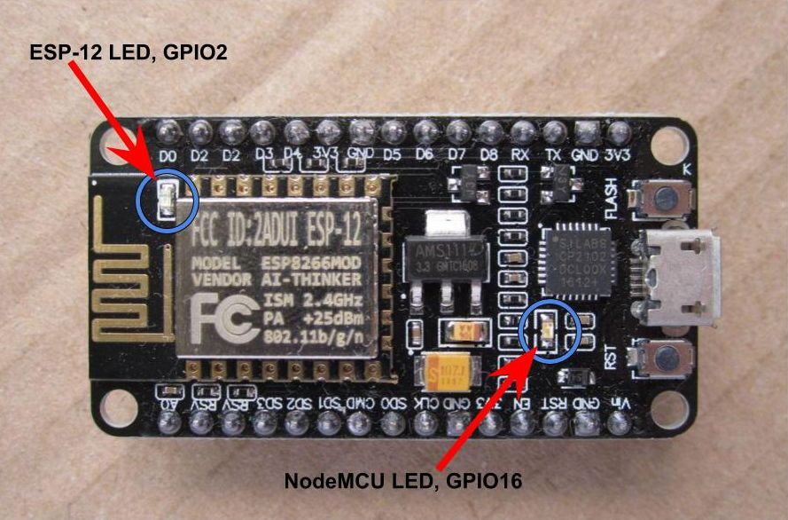

### NodeMCU

También podemos usar un ESP8266 de tipo NodeMCU que tiene 2 leds, uno en el módulo ESP y otro en la placa.  Usamos el del módulo



```yaml
light:
  - platform: status_led
    name: "Status Led"
    pin: 
      number: GPIO2
      inverted: true
  - platform: binary
    name: "Board led"
    output: light_output
```
