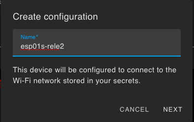
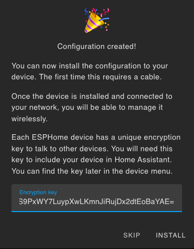
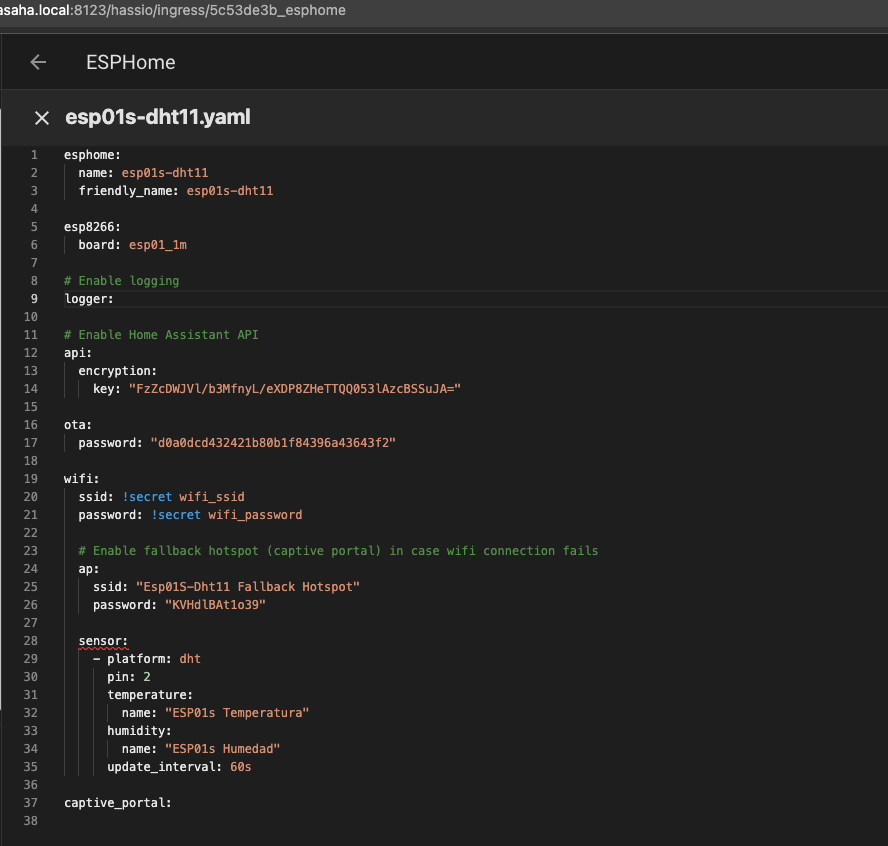
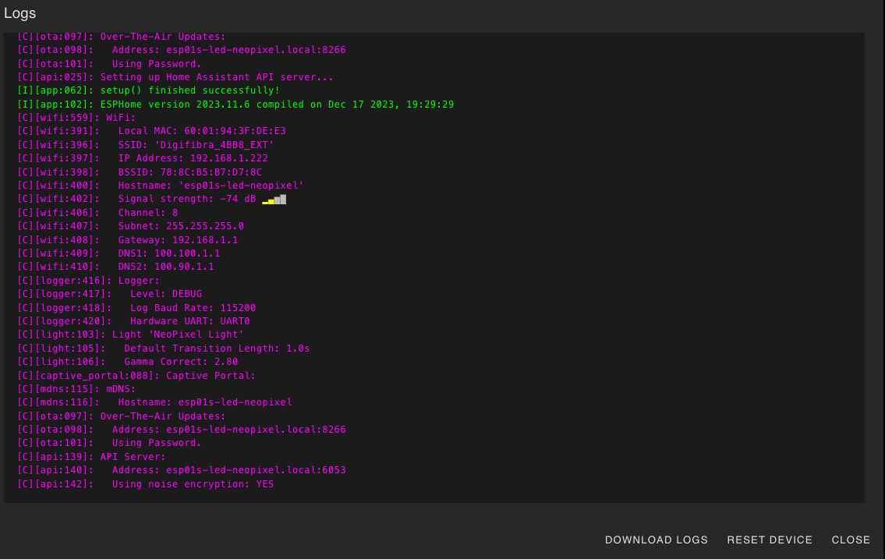
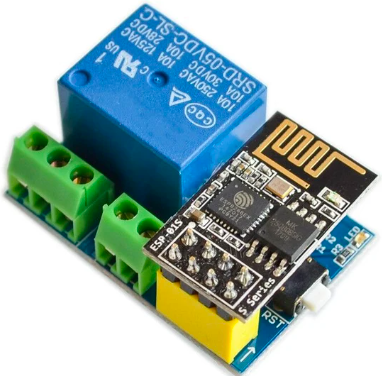
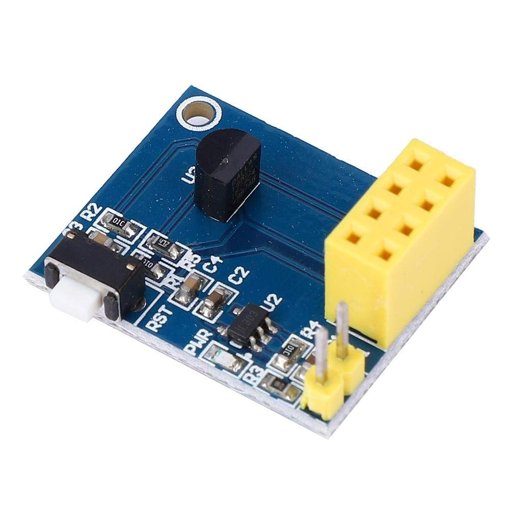
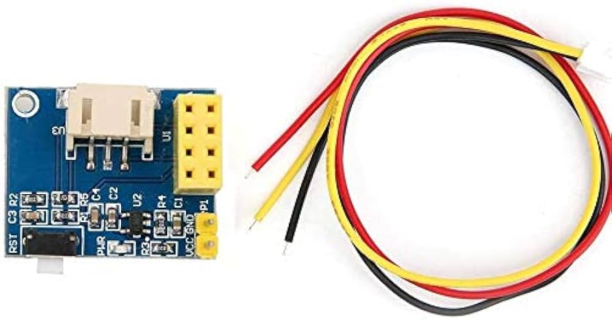

## Ejemplos ESP01s

El esp01s es la versión más reducida del esp8266 con 1Mb de almacenamiento. 


Tiene sólo 8 pines de los que podemos usar 4 como GPIO: 0, 1, 2, 3 siendo 1 y 3 Tx y Rx del UART (puerto serie). El pin 2 está conectado al led de la placa.


1. Creamos un nuevo dispositivo en el complemento ESPHome de HomeAssistant

1. Seleccionamos esp8266

1. Se crea el dispositivo y nos da la clave de encriptación (que podemos recuperar desde HA en cualquier momento)

1. Saltamos la opción de instalar y editamos la configuración para añadir a la configuración base (wifi, conexión a HA,...) los sensores o actuadores

1. Seleccionamos install y la primera vez Manual Download, las siguientes ya podremos usar OTA para hacer de manera inalámbrica

1. Una vez compilado, pulsamos "Download" para descargar el firmware compilado

1. Vamos a [https://web.esphome.io/](https://web.esphome.io/)
1. Con el esp01s **conectado en modo programación** pulsamos "Connect" y seleccionamos el puerto USB/serie al que está conectado

1. Pulsamos Install y seleccionamos el firmware que descargamos en el paso de antes y pulsamos Install para grabarlo en el esp01s

1. Si todo va bien nos avisa de que se ha instalado la configuración

1. Volvemos a ponerlo en modo normal
1. Volvemos a conectarlo a [https://web.esphome.io/](https://web.esphome.io/) y pulsamos Logs para ver la secuencia de arranque que ya debería de mostrarnos cómo se conecta al wifi y los datos de los sensores conectados

1. En Home Assistant veremos una notificación de que ha se detectado un nuevo dispositivo

1. Lo añadimos y ya tenemos acceso a sus datos y/o controlarlo

1. A partir de ahora los cambios que hagamos se pueden pasar directamente por OTA


### Ejemplos con ESP01s

Tomamos la información de los [repositorios del fabricante](https://github.com/IOT-MCU?page=2&tab=repositories) de estos módulos Iot MCU

#### ESP01s + relé

```yaml
esphome:
  name: esp01s-rele
  friendly_name: esp01s_rele

esp8266:
  board: esp01_1m

# Enable logging
logger:

# Enable Home Assistant API
api:
  encryption:
    key: "EF4qzDeSrPnmATPqKLQdt6JOFJMYoGrpeQI6FGnFIIc="

ota:
  password: "5ef093c66260a33e244972581210050a"

wifi:
  ssid: !secret wifi_ssid
  password: !secret wifi_password

  # Enable fallback hotspot (captive portal) in case wifi connection fails
  ap:
    ssid: "Esp01S-Rele Fallback Hotspot"
    password: "W92V18lK6OOQ"

switch:
  - platform: gpio
    name: "Relé"
    pin: 0

light:
  - platform: status_led
    name: "Led en placa"
    pin: 
      number: 2
      inverted: true

captive_portal:
    
```



Relé conectado en Pin 0

[Repositorio](https://github.com/IOT-MCU/ESP-01S-Relay-v4.0)

#### ESP01s + DHT11

DHT11 conectado en Pin 2

```yaml
esphome:
  name: esp01s-dht11
  friendly_name: esp01s-dht11

esp8266:
  board: esp01_1m

# Enable logging
logger:

# Enable Home Assistant API
api:
  encryption:
    key: "sadfasdfasdfasdfasdf"

ota:
  password: "werwerwerwerwerwerwer"

wifi:
  ssid: !secret wifi_ssid
  password: !secret wifi_password

  # Enable fallback hotspot (captive portal) in case wifi connection fails
  ap:
    ssid: "Esp01S-Dht11 Fallback Hotspot"
    password: "KVHdlBAt1o39"

sensor:
  - platform: dht
    pin: 2
    temperature:
      name: "ESP01s Temperatura"
    humidity:
      name: "ESP01s Humedad"
    update_interval: 60s

captive_portal:
    
```
[Repositorio](https://github.com/IOT-MCU/ESP-01S-DHT11-v1.0)

#### ESP01s + sensor de temperatura DS18b20



Pin de conexión del sensor DS18b20: Pin 2


```yaml
esphome:
  name: esp01s-ds18x20
  friendly_name: esp01s-ds18x20

esp8266:
  board: esp01_1m

# Enable logging
logger:

# Enable Home Assistant API
api:
  encryption:
    key: "A3TGT/r+GmLosv1G0XFGzOO/EA+7E2PoRu0AXFsUxBM="

ota:
  password: "670ab7c13a9018394c9ac4cb880b7bce"

wifi:
  ssid: !secret wifi_ssid
  password: !secret wifi_password

  # Enable fallback hotspot (captive portal) in case wifi connection fails
  ap:
    ssid: "Esp01S-Ds18X20 Fallback Hotspot"
    password: "fBJtUl73uQam"

# Example configuration 
# Creamos el hub de tipo Dallas en el pin al que está conectado
dallas:
  - pin: 2

# Individual sensors
sensor:
  - platform: dallas
    address: 0x1c0000031edd2a28
    name: "Temperatura ds18b20"

light:
  - platform: status_led
    name: "Led en placa"
    pin: 
      number: 2
      inverted: true

captive_portal:
    
```

[Repositorio](https://github.com/IOT-MCU/ESP-01-01S-DS18B20-v1.0)

#### ESP01s + LEDs RGB neopixels




Pin de control de los leds RGB: Pin 2


```yaml
esphome:
  name: esp01s-led-neopixel
  friendly_name: esp01s-led-neopixel

esp8266:
  board: esp01_1m

# Enable logging
logger:

# Enable Home Assistant API
api:
  encryption:
    key: "8VVsZCoETkmG1FfXpwfZcUefvapnp4dSDixC1cvx8Gg="

ota:
  password: "cad2b891f91e772ca2b244579661d092"

wifi:
  ssid: !secret wifi_ssid
  password: !secret wifi_password

  # Enable fallback hotspot (captive portal) in case wifi connection fails
  ap:
    ssid: "Esp01S-Led-Neopixel"
    password: "oRWWpV0KLoTa"

light:
  - platform: neopixelbus
    type: GRB
    variant: WS2811
    pin: 2
    num_leds: 24
    name: "NeoPixel Light"

captive_portal:
    
```


[Repositorio](https://github.com/IOT-MCU/ESP-01S-RGB-LED-v1.0/tree/master)


