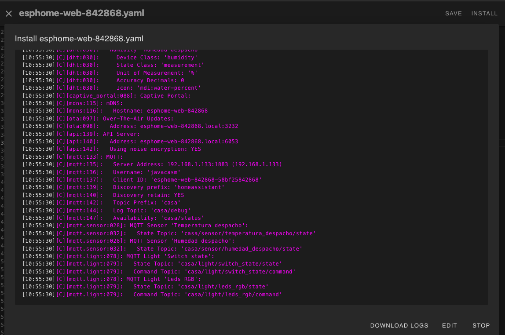

### Ejemplo MQTT

Al configurar la sección MQTT se publiclarán todos los datos y las acciones

```yaml
mqtt:
  topic_prefix: /casa
  broker: !secret mqtt_broker
  port: 1883
  username: !secret username_mqtt
  password: !secret password_mqtt
  discovery_prefix: homeassistant
```



