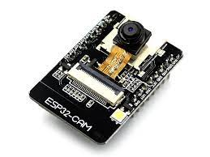
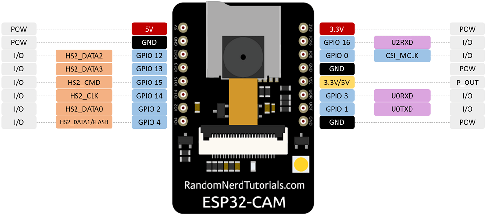

## Cámaras con ESPHome

#### ESP-CAM



Necesitas un adaptador UART/serie a USB




```yaml
esphome:
  name: esp-cam
  friendly_name: ESP-cam

esp32:
  board: esp32dev
  framework:
    type: arduino

# Enable logging
logger:

# Enable Home Assistant API
api:
  encryption:
    key: "SD6xaI0HGYOOi4pmwZt+HmU0MWH8zAg4H5AHIePa6t0="

ota:
  password: "4ce6608bb8578c0642cd512648498cfe"

wifi:
  ssid: !secret wifi_ssid
  password: !secret wifi_password

  # Enable fallback hotspot (captive portal) in case wifi connection fails
  ap:
    ssid: "Esp-Cam Fallback Hotspot"
    password: "zgUw473GPwNd"

captive_portal:

esp32_camera:
  name: espcam
  external_clock:
    pin: GPIO0
    frequency: 20MHz
  i2c_pins:
    sda: GPIO26
    scl: GPIO27
  data_pins: [GPIO5, GPIO18, GPIO19, GPIO21, GPIO36, GPIO39, GPIO34, GPIO35]
  vsync_pin: GPIO25
  href_pin: GPIO23
  pixel_clock_pin: GPIO22
  power_down_pin: GPIO32
  resolution: 1280x1024

light:
  - platform: monochromatic
    name: "Flash"
    output: flash 

output:
  - id: flash
    platform: ledc
    pin: GPIO4

# Flash binario
# light:
#  - platform: binary
#    name: "Flash"
#    output: light_output 

# output:
#  - id: flash
#    platform: gpio
#    pin: GPIO4

```

[Documentación](https://esphome.io/components/esp32_camera.html#configuration-for-ai-thinker-camera)

[Documentación de ESPHome sobre cámaras ESP32](https://esphome.io/components/esp32_camera.html)
