# ESPHome

https://esphome.io/index.html

ESPHome nos permite programar nuestro dispositivos DIY e integrarlos de forma sencilla en nuestro HA

Nos permite actualizar la programación desde local con USB o por wifi vía

Desde [https://web.esphome.io/](https://web.esphome.io/) hacemos una primera instalación 

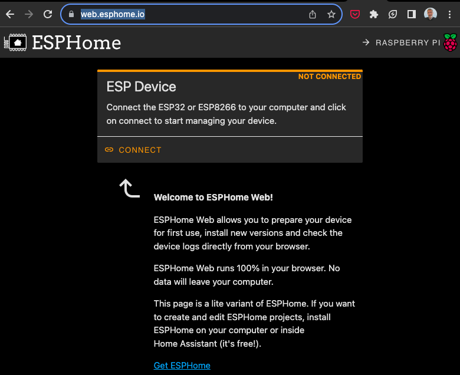
Debemos tener conectado el dispositivo por USB

Configuramos el wifi y ya tenemos acceso desde HA que lo detectará

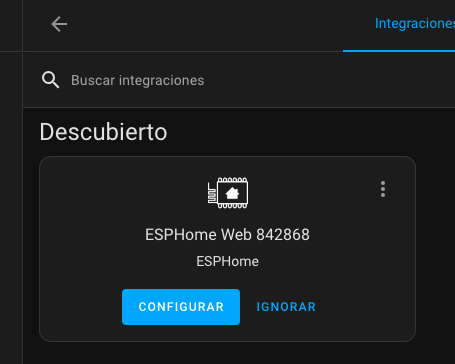

Podemos ver el registro de lo que va haciendo nuestro ESP desde la web de esphome.io y si hay problemas wifi lo veremos si la placa sigue conectada al USB

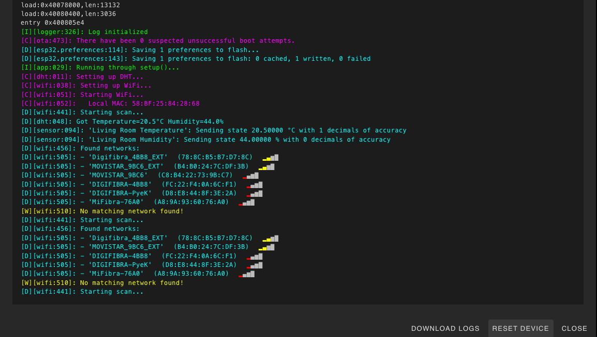

También podemos acceder directamente a la IP del dispositivo

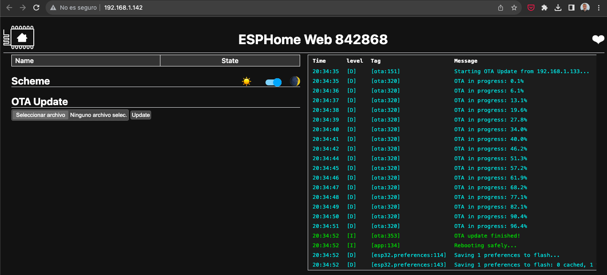

Y ya tenemos disponible el acceso innalámbrio via OTA


Modificamos la configuración (fichero yaml) 

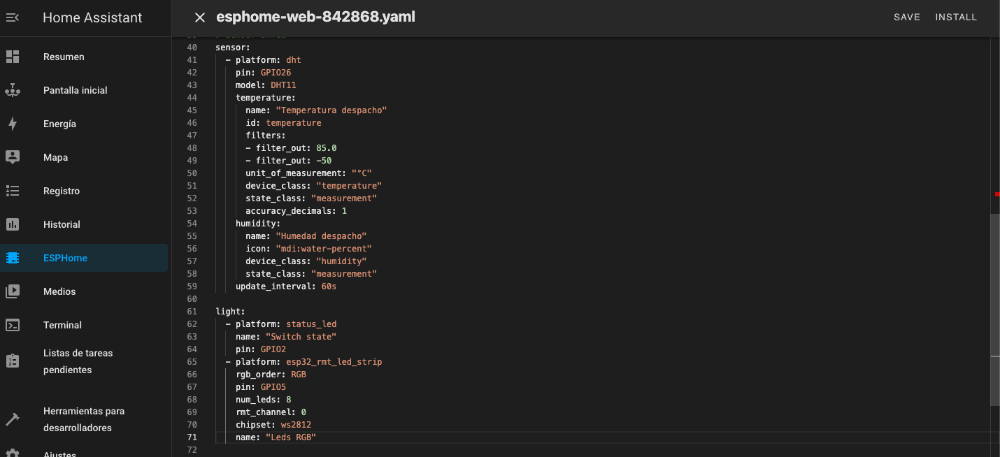

Tras compilarlo podemos subir la actualización

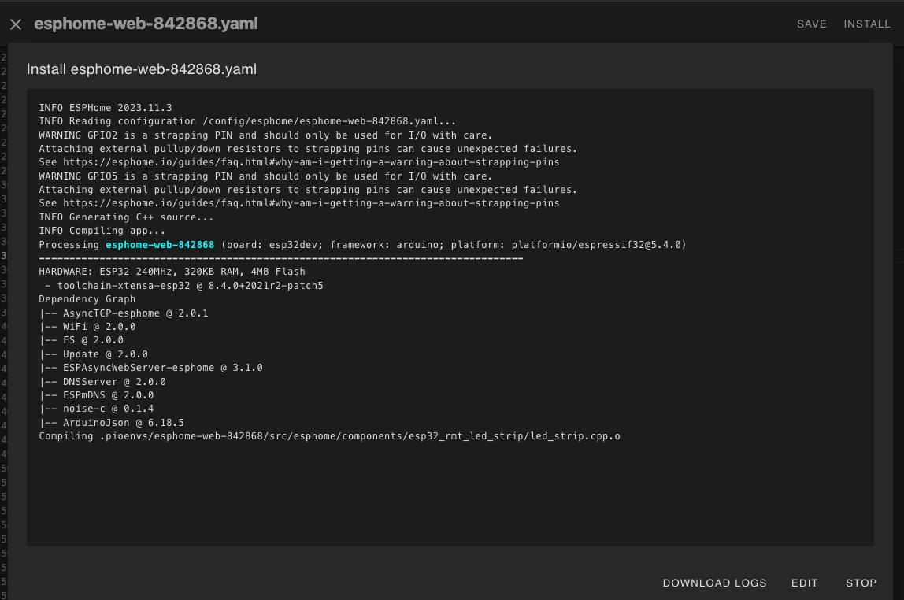

Tambien podemos subir una primera versión desde HA, pero tenemos que tener conecta en local el dispositivo a nuestro HA

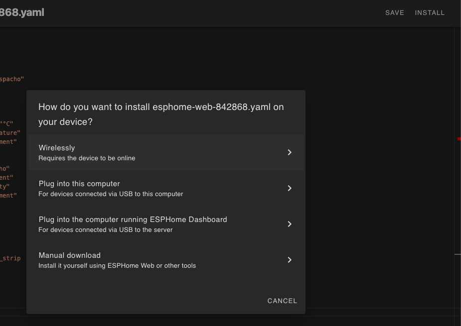

Y subirlo

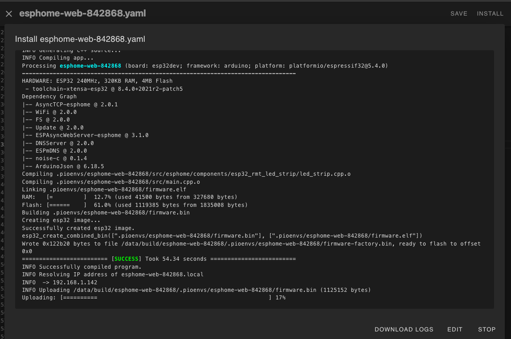

Cuando ya está conectado desde HA tendremos accesos a las entidades que estemos publicando

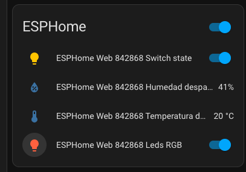

Pudiendo controlar los dispositivos

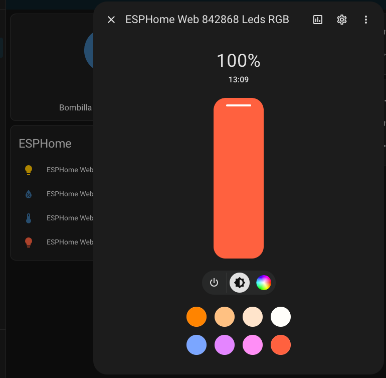

## Ejemplos

### Wifi

Vemos que hemos configurado los datos vía "Secret" para poder compartir la configuración y que en caso de que haya error de acceso al wifi genera su propia Wifi para que nos conectemos

```yaml
wifi:
  ssid: !secret wifi_ssid
  password: !secret wifi_password

  # Enable fallback hotspot (captive portal) in case wifi connection fails
  ap:
    ssid: "Esphome-Web-842868"
    password: "esQ682ybB185"
```

### Sensor DHT11

```yaml
# https://esphome.io/components/sensor/index.html
# Sensor DHT11
sensor:
  - platform: dht
    pin: GPIO26
    model: DHT11
    temperature:
      name: "Temperatura despacho"
      id: temperature
      filters:   
      - filter_out: 85.0
      - filter_out: -50
      unit_of_measurement: "°C"
      device_class: "temperature"
      state_class: "measurement"
      accuracy_decimals: 0
    humidity:
      name: "Humedad despacho"
      icon: "mdi:water-percent"
      device_class: "humidity"
      state_class: "measurement"
    update_interval: 60s
```
### LED

```yaml
light:
  - platform: status_led
    name: "Switch state"
    pin: GPIO2
```


### LED RGB

```yaml
light:
  - platform: esp32_rmt_led_strip
    rgb_order: GRB
    pin: GPIO13
    num_leds: 30
    rmt_channel: 0
    chipset: ws2812
    name: "My Light"
```

[Detalles](https://esphome.io/components/light/esp32_rmt_led_strip)

### Ejemplo MQTT

Al configurar la sección MQTT se publiclarán todos los datos y las acciones

```yaml
mqtt:
  topic_prefix: /casa
  broker: !secret mqtt_broker
  port: 1883
  username: !secret username_mqtt
  password: !secret password_mqtt
  discovery_prefix: homeassistant
```


### Servo

[Detalles](https://esphome.io/components/servo.html?highlight=servo)

[Tutorial](https://siytek.com/esphome-servo-example/)


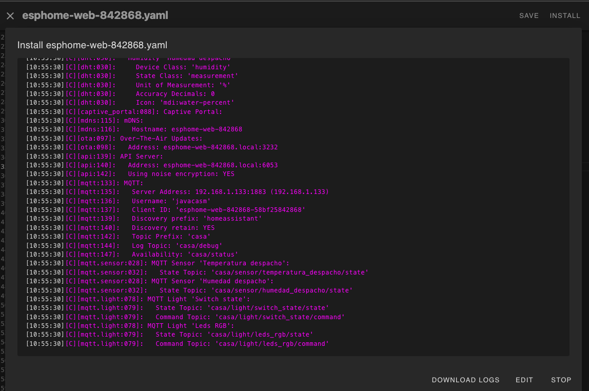


